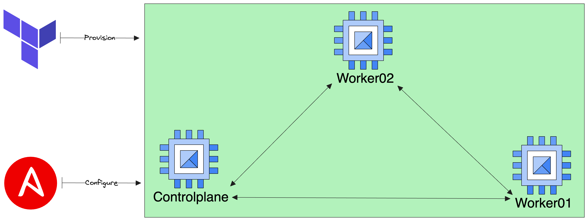

# Build A Kubernetes cluster using Terraform

Being able to build a Kubernetes cluster by provisioning GCP Compute Engine Instances.


## GCP Project

Multiple accounts in gcloud CLI? Create a new configuration and activate it using:

```bash
gcloud config configurations activate <CONFIG_NAME>
```

## Required stack

To run this you'll need few things:

- Terraform
- Ansible
- Folder in root project `./.ssh`

## Terraform part

It will create 3 instances:

- 1 controlplane
- 2 worker nodes

Each instance is labeled with ansible-group to define if it's either a controlplane or a node.

It will create a new Service Account and a SSH key that will be used as a user to connect using SSH for Ansible.

## Ansible part

It will by using 4 roles, install all dependencies and create a Kubernetes cluster.

I have defined 4 roles:

- Prepare-cluster: that will install common dependencies such as kubeadm, kubelet, containerd, etc...
- Master: that will install kubectl and create the cluster
- Node: that will make the worker node join the cluster previously created.
- Weave: that will install the CNI (WeaveNet)
